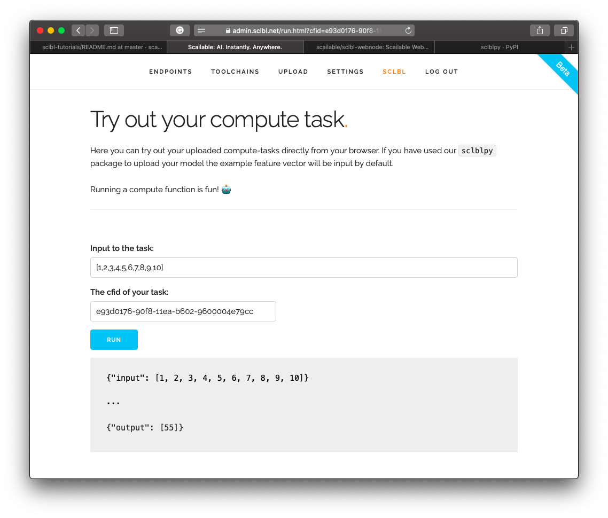
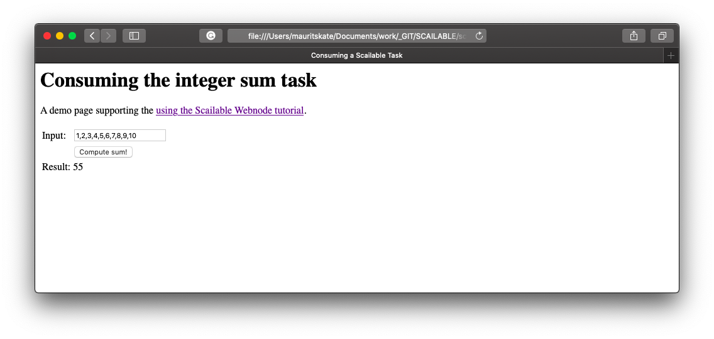

# Using the sclbl-WebNode
> Last 27-07-2020; By the Scailable core team.

This tutorial demonstrates the use of the [sclbl-WebNode](https://github.com/scailable/sclbl-webnode) to consume Scailable tasks on the web. The WebNode provides an open and minimal `JavaScript` implementation of a Scailable ComputeNode (i.e., a runtime for a Scailable WebAssembly task). The WebNode allows you to easily consume Scailable tasks on the web and allows you to control whether tasks are run either in the browser or on Scailable servers.

In this tutorial we will cover:

1. [Picking a Scailable task](#setup). To run a Scailable task, you will first need to create one. For this tutorial we will simply use the integer sum task we created in the [upload your own `.WASM`](https://github.com/scailable/sclbl-tutorials/blob/master/sclbl-create-your-own-wasm/README.md) tutorial. You can play with this task [here](https://admin.sclbl.net/run.html?cfid=e93d0176-90f8-11ea-b602-9600004e79cc&exin=%5B1%2C2%2C3%2C4%2C5%2C6%2C7%2C8%2C9%2C10%5D). 
2. [Including the `sclbl-webnode` JavaScript library](#include). While easy, we will show step-by-step how to include the `sclbl-webnode` JavaScript into your project.
3. [Consuming the task](#consuming). Next, we will demonstrate how to consume the task. All the code for the working example can be found [here](resources/demo/index.html).
4. [Wrap up](#wrapup). Finally, we will demonstrate how all of this comes together to use Scailable tasks directly in your browser (or on our severs). 

The source code and documentation of the `sclbl-webnode` are available at [https://github.com/scailable/sclbl-webnode](https://github.com/scailable/sclbl-webnode). 

<a name="setup"></a>
## 1. Picking a task
To get started using the `sclbl-webnode` we will first need to select a Scailable task that we will be consuming. Often, a Scailable task will be some machine learning or AI model that you (or others in your team) have trained and converted to WebAssembly using our [`sclblpy` python package](https://pypi.org/project/sclblpy/) or using a direct upload of `.wasm` or `ONNX`. In this tutorial, however, the focus is not on creating the model or task but on consuming it—so we will simply use the task we created in the [upload your own `.WASM`](https://github.com/scailable/sclbl-tutorials/blob/master/sclbl-create-your-own-wasm/README.md) tutorial. The task is super simple and you can test it [here](https://admin.sclbl.net/run.html?cfid=e93d0176-90f8-11ea-b602-9600004e79cc&exin=%5B1%2C2%2C3%2C4%2C5%2C6%2C7%2C8%2C9%2C10%5D). It takes as an input vector an array of integers and it returns the sum of these integers:



The actual `.WASM` file can be downloaded [here](https://cdn.sclbl.net:8000/file/e93d0176-90f8-11ea-b602-9600004e79cc.wasm). In the remainder of this tutorial we will show you how to easily consume this task in a browser or on a server using the `sclbl-webnode`.

> <b>Note:</b> The compute function ID, or simply `cfid` of this task is `e93d0176-90f8-11ea-b602-9600004e79cc`; we will need this `cfid` when consuming the task from our webpage.

<a name="include"></a>
## 2. Including the sclbl-webnode library

The aim of this tutorial is to show how the integer sum task can be used on any website, both locally (i.e., running in the browser itself) and remotely (i.e., by making a REST call to Scailable servers where the task is hosted). After we have selected a task we need to build a simple `HTML` page that will consume our task; here, we keep it as simple as possible. The following `HTML` generates a simple page with an input field (where the user can input the list of integers to be summed), a button, and a `div` element that can display the results of the task.

```html
<html lang="en">
<head>
  <meta charset="utf-8">
  <title>Consuming a Scailable Task</title>
</head>

<body>

	<h1>Consuming the integer sum task</h1>
	<p>A demo page supporting the <a href="">using the Scailable Webnode tutorial</a>.</p>
		
	<table>
		<!-- Input -->
		<tr>
			<td>Input:</td>
			<td> <input type="text" name="integers" value="1,2,3,4,5" id="input-integers"></td>
		</tr>
		<!-- Button -->
		<tr>
			<td></td>
			<td><button type="button" id="button-integers">Compute sum!</button></td>
		</tr>
		<!-- Result -->
		<tr>
			<td>Result:</td>
			<td><div id="output-integers"></div></td>
		</tr>
	</table>

  
</body>
</html>
```

After setting up this basic `HTML` page the only other element we need to do to include the `sclbl-webnode` on the page is to add the (minified) `JavaScript` library which is available [here](https://github.com/scailable/sclbl-webnode/raw/master/min/sclbl-webnode-min.js). 

To add it to the page we simply download the file, put it in the same folder as our `.html` file, and add the following line of `HTML` to our demo page just before the closing `</body>` tag:

```html
<script src="sclbl-webnode-min.js"></script>
```

After inclusion of this tag the `sclblRuntime` object will now be available to the`JavaScript` code.

> <b>Note:</b> The latest version of the `sclbl-webnode` is also available from our `cdn`; see [the docs](https://github.com/scailable/sclbl-webnode/raw/master/min/sclbl-webnode-min.js) for more details.

<a name="consuming"></a>

## 3. Consuming the task
We are now almost ready to start consuming our task: the only thing we still need to do is to add some custom JavaScript to *a)* identify which task we want to run (and to set our runtime preferences), and *b)* add the desired event handlers to make a click on the button on the page execute the task and display the result. Let's take these step-by-step.

### Setting the task properties
The `sclbl-webnode` allows you to easily configure which task you want to run and where you would like to run it. You can set the properties of the `sclblRuntime` object using the `options()` function. Specifically, you use the `options() ` function to set the `cfid` of the task you want to run and various other properties (see the [docs](https://github.com/scailable/sclbl-webnode) for a description of the other properties and their behavior). Here, we will use the default options and only set the `cfid` of the integer sum task that we found earlier:

```js
sclblRuntime.options({
	"cfid": "e93d0176-90f8-11ea-b602-9600004e79cc", 
});
```

> <b>Note:</b> By default the `sclbl-webnode` will try to run the desired task in the user's browser. If this fails (i.e., because the browser does not support WebAssembly) the `sclbl-webnode` will revert back to running the task remotely (i.e., on Scailable servers). This behavior can be fully controlled using the `options()` call.

### Adding the event handlers
While everyone seems to have their own taste in `JavaScript` these days, we will simply use the `sclbl-webnode` by adding a vanilla JavaScript event handler to the button in our page:

```js

// When button is pushed:
document.getElementById("button-integers").onclick = function(){

	// reset the result div value:
	document.getElementById("output-integers").innerHTML = "";

	// get the inputData:
	let inputData = document.getElementById("input-integers").value;

	// Run the task:
	sclblRuntime.run(inputData).then(function(response) {
		// result:
		document.getElementById("output-integers").innerHTML = response;
	}, function(error) {
		// or error:
		document.getElementById("output-integers").innerHTML = "An error occurred (see console for more details): " + error;
	});

}
```

That's all we need to consume the Scailable task in the browser!

> <b>Note:</b> The call to `sclblRuntime.run()` is asynchronous.

<a name="wrapup"></a>
## Wrap up.

The complete `.html` page needed to run the task looks like this:

```html
<html lang="en">
<head>
  <meta charset="utf-8">
  <title>Consuming a Scailable Task</title>
</head>

<body>

	<h1>Consuming the integer sum task</h1>
	<p>A demo page supporting the <a href="">using the Scailable Webnode tutorial</a>.</p>
		
	<table>
		<!-- Input -->
		<tr>
			<td>Input:</td>
			<td> <input type="text" name="integers" value="1,2,3,4,5" id="input-integers"></td>
		</tr>
		<!-- Button -->
		<tr>
			<td></td>
			<td><button type="button" id="button-integers">Compute sum!</button></td>
		</tr>
		<!-- Result -->
		<tr>
			<td>Result:</td>
			<td><div id="output-integers"></div></td>
		</tr>
	</table>

	<!-- include the sclbl-webnode -->
	<script src="sclbl-webnode-min.js"></script>

	<!-- some custom JavaScript to set properties and handle events -->
	<script>

		// Set task uptions:
		sclblRuntime.options({
			"cfid": "e93d0176-90f8-11ea-b602-9600004e79cc", 
		});

		// When button is pushed:
		document.getElementById("button-integers").onclick = function(){

			// reset the result div value:
			document.getElementById("output-integers").innerHTML = "";

			// get the inputData:
			let inputData = document.getElementById("input-integers").value;

			// Run the task:
			sclblRuntime.run(inputData).then(function(response) {
				// result:
				document.getElementById("output-integers").innerHTML = response;
			}, function(error) {
				// or error:
				document.getElementById("output-integers").innerHTML = "An error occurred (see console for more details): " + error;
			});

		}

	</script>

  
</body>
</html>

```
... of which you can find the source [here](resources/demo).

On my computer, the page looks like this:



... and works like a charm! 

Again, the task will be executed in your local browser (that is, client-side) if possible. If this fails (i.e., because the browser does not support WebAssembly) the `sclbl-webnode` will revert to running the task remotely (i.e., on Scailable servers, or server-side). This behavior can be fully controlled using the `options()` call.


-----

Thanks for your attention! Let us know if you have any suggestions please let us know by [creating a new issue](https://github.com/scailable/sclbl-tutorials/issues/new) or emailing us at [go at scailable dot net](mailto:go@scailable.net).

If you find any mistakes in our tutorials, please do [add an issue](https://github.com/scailable/sclbl-tutorials/issues/new) so we can fix it asap!


